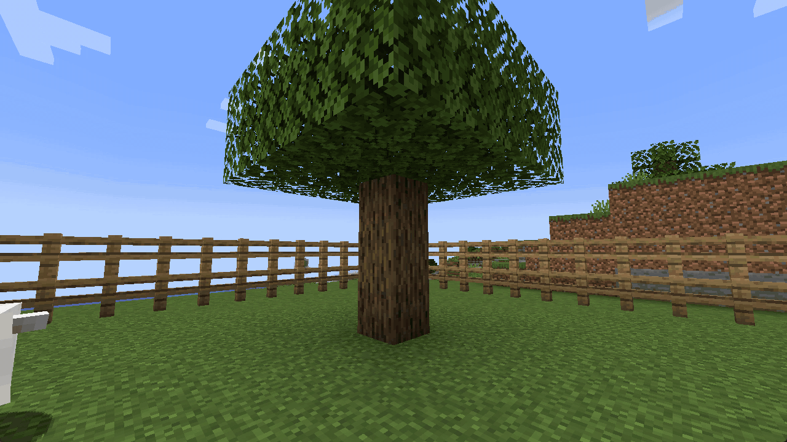
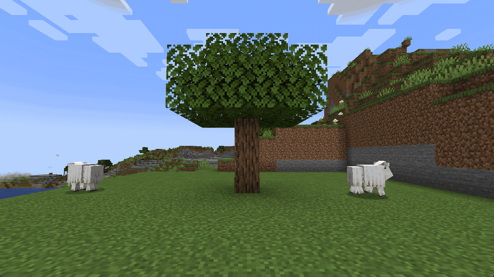
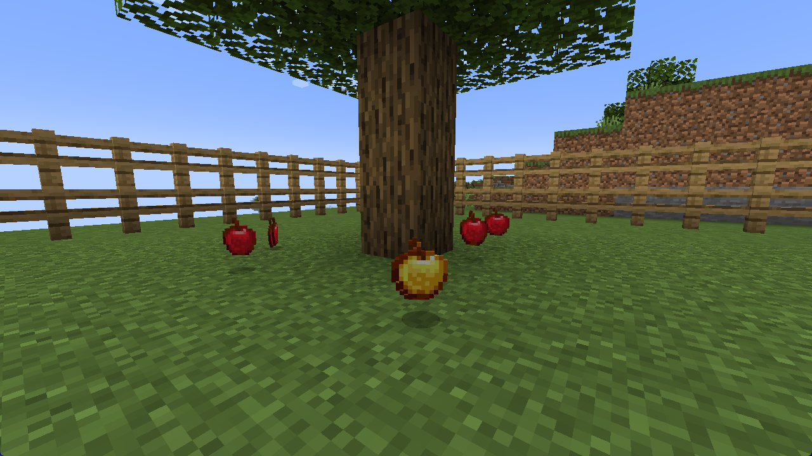
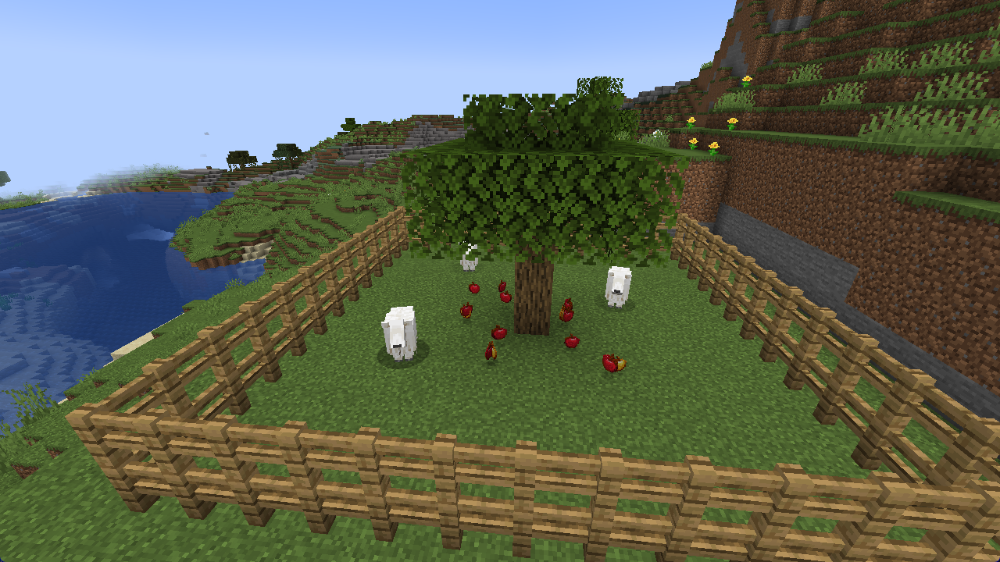
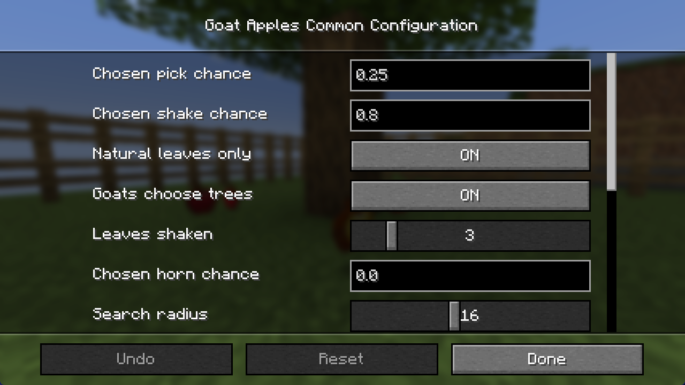

# Goat Apples

**Goats headbutt trees and apples fall out of the leaves.**

NeoForge and Fabric · Minecraft 1.20.1 to 26.2 · server side only · MIT. Based on the Minecraft
feedback post "Apples falling from trees when goats ram them".

## Versions

| Minecraft | NeoForge | Fabric |
| --- | :---: | :---: |
| 26.2 | Yes | Yes |
| 26.1.2 | Yes | Yes |
| 1.21.11 | Yes | Yes |
| 1.21.1 | Yes | Yes |
| 1.20.1 | No | Yes |

Every jar is on [Modrinth](https://modrinth.com/mod/goat-apples/versions),
[CurseForge](https://www.curseforge.com/minecraft/mc-mods/goat-apples/files) and the
[release page](https://github.com/NeryosX/goat-apples/releases/latest). Pick the one named for your
loader and game version. The Fabric jars need Fabric API.

## A goat with nothing to ram picks a tree

A goat that has nobody to charge sometimes walks up to a fruit tree nearby, lowers its head and
charges it the same way it charges a player. The canopy shakes and a few apples drop out from under
the leaves.

## A missed charge shakes the tree too

Step out of the way of a charging goat next to a tree and the goat hits the trunk instead. Whether
that costs it a horn is up to you: always, only when the tree shakes, or never.

## Now and then, a golden apple

## A goat pen is an apple farm

Goats charging a tree they picked keep their horns by default, and a goat with no horns left still
shakes trees. A tree rests for a while after it drops fruit, and nothing drops while too many items
already lie nearby, so a pen never floods the ground.

## Every number is yours

Chances, the search radius, the tree's rest time, the horn rules and the item cap are all in
`config/goatapples-common.toml` (NeoForge) or `config/goatapples-common.json` (Fabric), and changes
are picked up while the game runs. Operators can run `/goatapples` to see whether baited charges
shake trees and which horn mode is set.

## Install

Drop the jar into `mods/` on the server. Players don't need it, and vanilla clients can join. It
adds no blocks, items, entities or network channels. The Fabric version needs Fabric API.

## Building

The source here is the Minecraft 1.21.1 version. Each loader is its own Gradle build and needs
Java 21: `cd neoforge` or `cd fabric`, then `./gradlew build`. The jar ends up in `build/libs`.
Bugs and ideas: <https://github.com/NeryosX/goat-apples/issues>.

## Made with Modryos

Goat Apples was built in [Modryos](https://modryos.com), a mod engine for Minecraft.

## License

MIT. Modpacks welcome, no permission needed.
